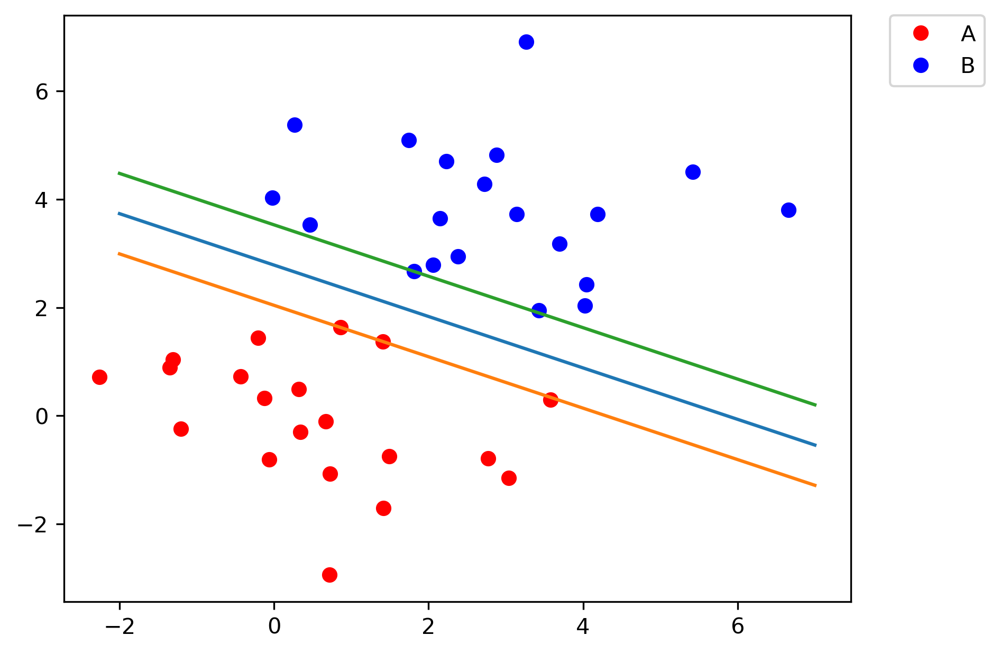

An example of SVM method from scratch.

## output
```
##### Optimization #####
     pcost       dcost       gap    pres   dres
 0: -3.6393e+01 -2.7553e+03  8e+03  8e-01  4e-14
 1: -1.1523e+00 -7.0257e+02  1e+03  8e-02  5e-14
 2:  1.5190e+01 -9.9659e+01  2e+02  9e-03  2e-14
 3:  3.8472e+00 -8.5882e+00  1e+01  1e-04  1e-14
 4: -2.1783e-01 -1.7910e+00  2e+00  3e-16  4e-15
 5: -7.2713e-01 -1.2125e+00  5e-01  2e-16  2e-15
 6: -1.0312e+00 -1.1786e+00  1e-01  2e-16  3e-15
 7: -1.0973e+00 -1.1164e+00  2e-02  7e-16  2e-15
 8: -1.1074e+00 -1.1077e+00  3e-04  2e-16  3e-15
 9: -1.1076e+00 -1.1076e+00  3e-06  4e-16  3e-15
10: -1.1076e+00 -1.1076e+00  3e-08  2e-16  4e-15
Optimal solution found.

support vectors: [ 1 16 39] 


w =  [-0.63893416 -1.34420494]
b =  3.742242318662863

You can check the value of (w^T x + b) for each support vector:
support vector 1:  1.000000004106659 ~ +1
support vector 16:  0.9999999827313895 ~ +1
support vector 39:  -0.9999999868380489 ~ -1
```

## Visualization
